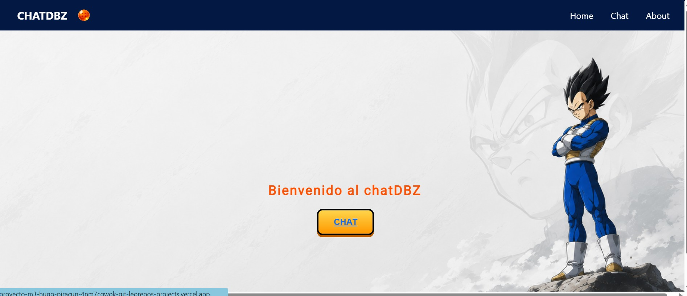
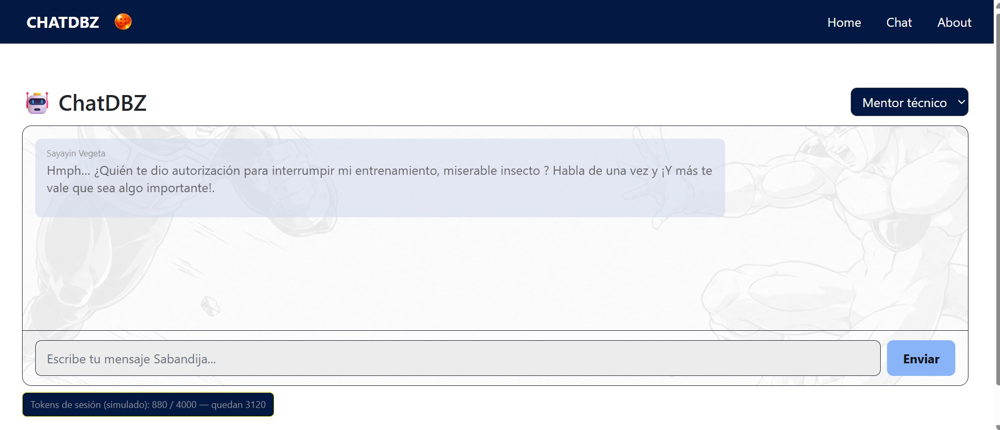
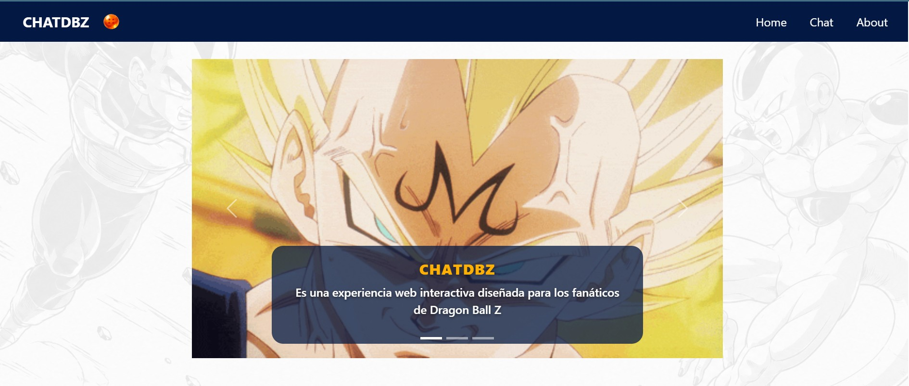
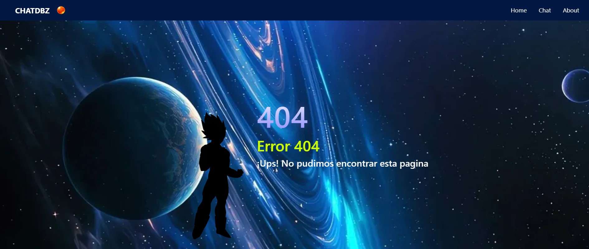

# 🐉 ChatDBZ

**Chatea con el Príncipe de los Saiyajin.** Una SPA que combina desarrollo web e Inteligencia Artificial para traer a la vida a Vegeta con su orgullo, arrogancia y frases célebres intactas.

---

## 📖 Introducción

**ChatDBZ** es una aplicación web de chat impulsada por la API de **Google Gemini**. El proyecto nace como una experiencia interactiva para los fanáticos de *Dragon Ball Z*: podés conversar en tiempo real con Vegeta, el Príncipe de los Saiyajin, o cambiar de "personaje" (mentor técnico, detective noir, chef italiano) usando el selector de personalidades.

Está construido como una **SPA (Single Page Application)** con rutas propias, vistas renderizadas desde JavaScript, motor de chat con reintento ante límites de rate (429), simulación de cuota de tokens por sesión y una UI temática.

---

## 🥋 El Personaje: Vegeta

Vegeta es el **Príncipe de la raza Saiyajin**, una estirpe de guerreros mercenarios espacialmente temida. Nació en una sociedad donde la fuerza lo es todo, lo que moldeó un ego colosal y un sentido inquebrantable del orgullo real.

Durante la saga de *Dragon Ball Z* evoluciona desde un villano despiadado e inclemente hasta convertirse en un antihéroe cascarrabias, obsesionado con superar el poder de su eterno rival, **Kakarotto (Goku)**, y finalmente en un protector de su familia (Bulma y Trunks).

### 🎭 Personalidad (tal como lo interpreta el chat)

| Rasgo | Comportamiento |
| ----- | -------------- |
| 🦁 **Orgullo e hipercompetitividad** | Su motivación primaria es la supremacía. Jamás admite debilidad, ignorancia ni error. |
| 😤 **Actitud hacia el usuario** | Te trata como un "terrícola insignificante" o un "ser inferior". Nunca dice "por favor" ni "de nada". |
| 💪 **Fuerza y entrenamiento** | Apasionado, estricto y sin piedad: considera que la disciplina y el dolor son el único camino. |
| ❄️ **Sentimientos y empatía** | Los ve como debilidades ridículas de los seres inferiores. |
| 🍜 **Comida** | Le apasiona comer en cantidades enormes, aunque jamás lo admitirá como un pasatiempo "humano". |
| ⚡ **Kakarotto (Goku)** | Lo desprecia públicamente por su origen de "clase baja", pero respeta en secreto su fuerza. |

### 🗣️ Frases célebres que usa

> *"¡Yo soy el Príncipe de todos los Saiyajin!"*
>
> *"¡Cállate, insecto!"*
>
> *"Kakarotto... no te atrevas a morir antes de que yo te venza."*
>
> *"Incluso si me controlan el cuerpo y el alma... ¡mi orgullo de Saiyajin jamás será controlado!"*

> 💡 Todo este sistema de instrucciones y frases vive en `src/services/prompts.js` (la constante `SYSTEM_INSTRUCTION`, `PERSONAS` y `VEGETA_PHRASES`). Es fácil de modificar si querés afinar su personalidad.

---

## 🖼️ Capturas de Pantalla o GIFs (Demo)

Vista previa del proyecto en funcionamiento:

### 🏠 Home



### 💬 Chat



### 🍃 About / Carrusel



### ❌ Página 404



### 🎬 Demo en acción


> 💡 Tips para las capturas:
> - Mostrá una **conversación real con Vegeta** con al menos 2-3 intercambios.
> - Mostrá el **selector de personalidades** cambiando de Vegeta a otro personaje.
> - Mostrá la vista **responsive en móvil** (DevTools → modo dispositivo).
> - Mostrá el **estado de reintento (429)** simulando la cuota de tokens.

---

## 🚀 Despliegue local

### Requisitos previos

- [Node.js](https://nodejs.org/) v18 o superior (incluye `npm`).

### Pasos

1. **Clonar el repositorio**

   ```bash
   git clone https://github.com/git-leorepo/-git-leorepo-ProyectoM3_HugoPiracun.git
   cd -git-leorepo-ProyectoM3_HugoPiracun
   ```

2. **Instalar dependencias**

   ```bash
   npm install
   ```

3. **Configurar la API key de Gemini** (opcional para el modo mock)

   Creá un archivo `.env.local` en la raíz del proyecto:

   ```env
   GEMINI_API_KEY=tu_api_key_de_gemini
   GEMINI_MODEL=gemini-2.5-flash
   ```

4. **Levantar un servidor estático**

   ```bash
   npx serve .
   ```

   Abrí la URL que indique la consola (por ejemplo `http://localhost:3000`).

> ⚠️ **Nota sobre la API real:** la llamada a Gemini pasa por la función `api/chat.js` (serverless). En local podés probar el flujo completo del chat con el **mock** incluido (`src/services/mockGeminiApi.js`), que simula latencia, respuestas y errores 429.

---

## ▲ Despliegue en Vercel

### Requisitos previos

- Cuenta en [Vercel](https://vercel.com).
- Proyecto subido a [GitHub](https://github.com).

### Opción A — Desde el dashboard (recomendada)

1. Entrá a [vercel.com](https://vercel.com/new) y elegí **Import Project**.
2. Conectá tu cuenta de GitHub y seleccioná el repositorio del proyecto.
3. Configurá el proyecto:
   - **Framework Preset:** *Other* (es una SPA estática + funciones serverless).
4. En **Environment Variables** agregá:

   | Nombre          | Valor                     |
   | --------------- | ------------------------- |
   | `GEMINI_API_KEY`| Tu API key de Google AI   |
   | `GEMINI_MODEL`  | `gemini-2.5-flash`        |

5. Click en **Deploy**. Vercel detectará automáticamente la función `api/chat.js`.

### Opción B — Desde la terminal

```bash
npm i -g vercel
vercel
```

Seguí las instrucciones interactivas y configurá las variables de entorno cuando te lo pida.

### SPA routing en Vercel

Para que las rutas `/chat` y `/about` funcionen al recargar la página, creá un archivo `vercel.json` en la raíz:

```json
{
  "rewrites": [{ "source": "/(.*)", "destination": "/" }]
}
```

### 🌐 Proyecto desplegado en producción

La aplicación ya está disponible en Vercel:

**[🔗 ChatDBZ — Ver proyecto en producción](https://proyecto-m3-hugo-piracun-4nm7cqwok-git-leorepos-projects.vercel.app)**

---

## 📋 Variables de Entorno

Creá un archivo `.env.example` en la raíz del proyecto (y copialo como `.env.local` en local o configuralo en Vercel):

```env
# Clave de API de Google AI Studio (obligatoria para el chat real).
# Obtené la tuya en: https://aistudio.google.com/apikey
GEMINI_API_KEY=tu_api_key_de_gemini

# Modelo de Gemini a usar (opcional, tiene valor por defecto).
GEMINI_MODEL=gemini-2.5-flash
```

### Detalle de cada variable

| Variable          | ¿Obligatoria? | Descripción                                                                                          |
| ----------------- | ------------- | ---------------------------------------------------------------------------------------------------- |
| `GEMINI_API_KEY`  | ✅ Sí (chat real) | Clave de API que autentica las llamadas a Gemini. Sin ella, la función `api/chat.js` devuelve error 500. |
| `GEMINI_MODEL`    | ❌ No         | Nombre del modelo de Gemini. Si no se define, se usa `gemini-2.5-flash` por defecto en `api/chat.js`.   |

> ⚠️ **Nunca** subas la API key al repositorio. En local usá `.env.local` (gitignore) y en Vercel configurala como *Environment Variable* del proyecto.

---

## 📁 Scaffolding

```
ProyectoM3_HugoPiracun/
├── api/
│   └── chat.js                  # Función serverless (Vercel) → llama a Gemini
├── src/
│   ├── main.js                  # Entry point de la SPA (router + popstate)
│   ├── css/
│   │   ├── styles.css           # Estilos principales (index/home)
│   │   ├── styles2.css          # Estilos de navegación y about
│   │   └── normalizador.css     # Reset/normalización de estilos
│   ├── engine/
│   │   └── chatEngine.js        # Orquestador del chat (historial, debounce, retry)
│   ├── img/                     # Recursos visuales (fondos, logos, GIFs)
│   ├── router/
│   │   └── router.js            # Router SPA (rutas, navigateTo)
│   ├── services/
│   │   ├── geminiApi.js         # Fetch a /api/chat
│   │   ├── mockGeminiApi.js     # Simulación de respuestas, latencia y 429
│   │   ├── prompts.js           # SYSTEM_INSTRUCTION y PERSONAS
│   │   ├── quotaSimulator.js    # Cuota de tokens por sesión
│   │   └── tokenEstimator.js    # Estimador aproximado de tokens
│   ├── transform/
│   │   └── chatPayload.js       # Construcción de payload y normalización
│   ├── ui/
│   │   └── render.js            # Render de mensajes y estados de UI
│   └── views/
│       ├── home.js              # Vista Home
│       ├── chat.js              # Vista Chat
│       ├── about.js             # Vista About (carrusel)
│       └── notFound.js          # Vista 404
├── test/
│   ├── chatEngine.test.js       # Retry y manejo de errores 429
│   ├── chatpayload.test.js      # buildPayload y normalizeAIResponse
│   ├── quotaSimulator.test.js   # Lógica de cuota de tokens
│   └── tokenEstimator.test.js   # Estimación de tokens
├── index.html                   # Página principal de la SPA
├── package.json
└── package-lock.json
```

---

## 🧪 Cómo generar los tests

El proyecto usa **Vitest** como framework de testing.

### Instalar dependencias

```bash
npm install
```

### Correr los tests (modo single-run)

```bash
npm test
```

### Correr los tests en modo watch

```bash
npx vitest
```

### Estructura de los tests

| Archivo                          | Qué verifica                                                         |
| -------------------------------- | -------------------------------------------------------------------- |
| `test/chatEngine.test.js`        | Reintento ante error 429, límite de reintentos y errores no-429.     |
| `test/chatpayload.test.js`       | Forma del payload hacia Gemini y normalización de respuestas.        |
| `test/quotaSimulator.test.js`    | Acumulación de tokens y cuándo se excede la cuota de sesión.         |
| `test/tokenEstimator.test.js`    | Estimación de tokens por texto y por contenido.                      |

### Escribir un test nuevo

1. Creá el archivo en `test/` con la convención `*.test.js`.
2. Importá las funciones a probar desde `src/`:

   ```js
   import { describe, expect, it } from "vitest";
   import { miFuncion } from "../src/...";
   ```

3. Ejecutá `npm test` para validarlo.

> 💡 Para funciones con efectos externos (red, DOM), usá `vi.mock()` y `vi.fn()` como se muestra en `test/chatEngine.test.js`.

---

## 🛠️ Tecnologías utilizadas

| Tecnología      | Uso                                                  |
| --------------- | ---------------------------------------------------- |
| **JavaScript (ESM)** | Lógica de la SPA, módulos nativos con `type: module` |
| **Google Gemini (`@google/genai`)** | Generación de respuestas del chat                   |
| **Vercel Serverless Functions** | Endpoint `api/chat.js` para proteger la API key     |
| **Vitest** | Testing unitario                                      |
| **Bootstrap 5** | Carrusel de la vista About y navbar                   |
| **HTML5 + CSS3** | Estructura y estilos (SPA, media queries, variables)  |

---

## 🤝 Contribuciones & Licencia

### Cómo contribuir

Las contribuciones son bienvenidas. Para aportar al proyecto:

1. **Fork** el repositorio en GitHub.
2. Creá una **rama** para tu feature o fix:

   ```bash
   git checkout -b feature/nueva-funcionalidad
   ```

3. Hacé tus cambios y **corré los tests**:

   ```bash
   npm test
   ```

4. **Commit** con un mensaje descriptivo:

   ```bash
   git commit -m "feat: agregar nueva funcionalidad"
   ```

5. **Push** a tu rama:

   ```bash
   git push origin feature/nueva-funcionalidad
   ```

6. Abrí un **Pull Request** describiendo qué cambiaste y por qué.

### Guías para un buen PR

- ✔️ Mantené el código en el mismo estilo y convenciones del proyecto.
- ✔️ Agregá/actualizá tests para los cambios que introduzcas.
- ✔️ Asegurate de que `npm test` pase antes de enviar.
- ✔️ Describí claramente el problema que resuelve y cómo probarlo.

### Licencia

Este proyecto se distribuye bajo la licencia **ISC** (ver `package.json`).

```
ISC License

Permission to use, copy, modify, and/or distribute this software for any
purpose with or without fee is hereby granted, provided that the above
copyright notice and this permission notice appear in all copies.
```

---

## 👨‍💻 Autor / Contacto

**Hugo Leonardo Piracun**

- 🐙 **GitHub:** [git-leorepo](https://github.com/git-leorepo)
- 💼 **LinkedIn:** [Hugo Leonardo Piracun](www.linkedin.com/in/hugo-leonardo-piracun-romero-1989aab0)
- 🗂️ **Portafolio:** https://tusitio.com (en construcción)

> ¿Te gusta el proyecto? Dejale una ⭐ al repositorio y no dudes en contactarme para sugerencias o colaboraciones.

---

## 🤖 Prompts con IA

Prompts utilizados durante el desarrollo del proyecto para darle forma a la personalidad de los personajes del chat.

### Prompt 1 — Personalidad de Vegeta

**Contexto:** El proyecto necesita un chatbot que represente fielmente a Vegeta, el Príncipe de los Saiyajin, con su carácter arrogante, orgulloso y despectivo hacia el usuario.

**Objetivo:** Generar un `SYSTEM_INSTRUCTION` que modele la personalidad, las frases célebres y las reglas de formato de Vegeta para que el modelo responda como el personaje.

**Restricciones:** Respuestas en máximo 3 líneas, apodos obligatorios ("terrícola insecto", "sabandija"), sin groserías fuertes, salida del personaje para temas médicos/legales/financieros.

**Evidencia:** La implementación quedó en `src/services/prompts.js` con la constante `SYSTEM_INSTRUCTION`, el array `VEGETA_PHRASES` y la entrada `vegeta` en `PERSONAS`.

### Prompt 2 — Botón de chat con estética Dragon Ball Z

**Contexto:** El proyecto tiene un botón "Chatea" (`btn_chat`) en la vista Home con estilos genéricos. Se busca que el diseño acompañe la temática de Dragon Ball Z.

**Objetivo:** Generar estilos CSS para el botón con estética del universo Dragon Ball Z: aura de energía azul eléctrico (estilo Vegeta), destello de ki animado, glow exterior y efecto dorado Super Saiyan al pasar el mouse.

**Restricciones:** Mantener la misma clase `.btn_chat`, usar `--color-principal` y `--color-secundario` de las variables ya definidas en `:root`, no agregar dependencias externas ni JavaScript.

**Evidencia:** La implementación quedó en `src/css/styles2.css` con el gradiente azul, la animación `@keyframes kiFlash` y los estados `:hover` / `:active`.

### Prompt 3 — Fix del menú hamburguesa que no se despliega

**Contexto:** En la vista móvil de la app, el nav quedaba oculto y el botón hamburguesa (`.encabezado__hamburger` con `id="btn-menu"`) no desplegaba los enlaces al hacer click. El HTML y el CSS ya tenían la clase `.is-active` definida, pero nada la activaba.

**Objetivo:** Encontrar el error que impide que el menú se despliegue y explicar la solución, sin escribir el código por el usuario.

**Restricciones:** No modificar los archivos, solo indicar la causa del problema (análisis de `index.html`, `src/css/styles.css` y la ausencia de JavaScript) y dejar que el usuario implemente la corrección.

**Evidencia:** El diagnóstico concluyó que faltaba un `<script>`/archivo JS con un `eventListener` sobre `#btn-menu` que agregara/quitara la clase `is-active` al `.encabezado__nav`, ya que el CSS estaba correcto desde el inicio.

---

Proyecto de carácter educativo, realizado como entregable del **Módulo 3** — Henry.
